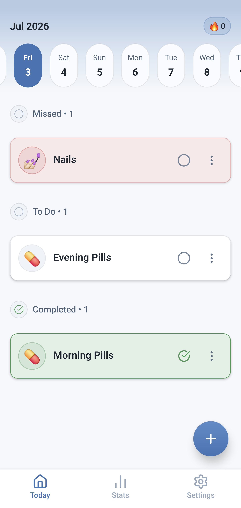
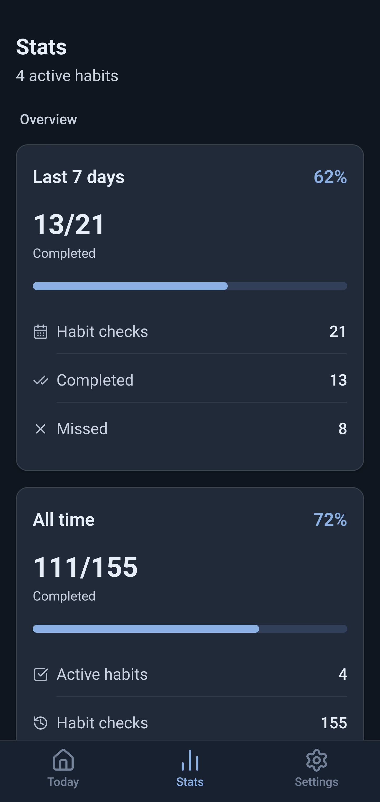
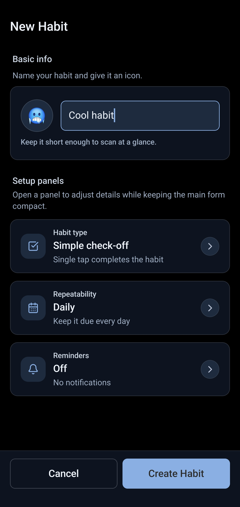
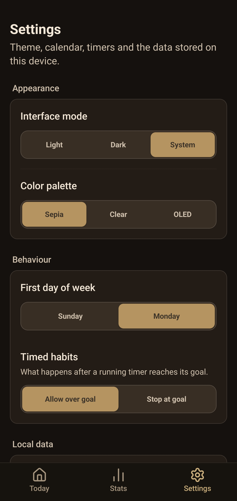

<p align="center">
  
</p>

<h1 align="center">YAHT — Yet Another Habit Tracker</h1>

<p align="center">
  Track habits. Own your data.<br />
  A free, open-source, privacy-first habit tracker built with React Native and Expo.
</p>

<p align="center">
  <a href="https://yaht.niqp.dev"><b>yaht.niqp.dev</b></a>
</p>

<p align="center">
  
  
  
  
</p>

## Why YAHT?

Everything you need, nothing you don't — no clutter, no feature bloat, no signups, no cloud accounts. All your data stays on your device.

- **Three habit types** — simple yes/no checkmarks, counters (like cups of water), or timed routines with an integrated stopwatch
- **Alarms & snooze** — set an exact alarm per habit, with optional follow-up nags spaced however you like; snooze or complete habits right from the notification
- **Reliable reminders** — notifications fire even when the app is fully closed, with timezone correction when you travel
- **Streaks & charts** — completion history, streaks, and habit trends over time, all calculated locally
- **Easy JSON backups** — export your data to a JSON file or import it back with one tap
- **Make it yours** — warm Sepia tones, clear blue-grays, or pure black OLED dark mode, each with light and dark variants; customizable week start day
- **Localized** — available in English and Russian

## Getting Started

1. Install dependencies

   ```bash
   npm install
   ```

2. Start the development server

   ```bash
   npm start
   ```

   Or run directly on a specific platform:

   ```bash
   # For Android
   npm run android

   # For iOS
   npm run ios
   ```

3. Run a clean build if needed:

   ```bash
   npm run cleanRun
   ```

## Available Scripts

- `npm start` - Start the Expo development server
- `npm run android` - Run on Android
- `npm run ios` - Run on iOS
- `npm run web` - Run in web browser
- `npm run cleanPrebuild` - Clean the prebuild files
- `npm run cleanRun` - Clean and run on Android
- `npm run build:android:debug` - Prebuild and assemble a debug Android APK
- `npm run build:android:prod` - Prebuild and assemble a release Android APK
- `npm run prod` - Run the Android release variant on a device
- `npm run typecheck` - Run TypeScript type checking
- `npm run lint` - Run ESLint
- `npm test` - Run Jest
- `npm run format:check` - Check Prettier formatting

## Tech Stack

- [Expo](https://expo.dev) with [Expo Router](https://docs.expo.dev/router/introduction) for file-based routing
- [Zustand](https://github.com/pmndrs/zustand) for state management, persisted with [MMKV](https://github.com/mrousavy/react-native-mmkv)
- [i18next](https://www.i18next.com/) for localization
- [Dayjs](https://day.js.org/) for date handling
- [React Native Reanimated](https://docs.swmansion.com/react-native-reanimated/) for animations
- [Bottom Sheet](https://github.com/gorhom/react-native-bottom-sheet) for interactive UI components
- Custom React Native chart components for statistics visualization

## Project Layout

- `app/` — screens (Expo Router)
- `components/`, `hooks/`, `store/`, `utils/` — app logic and UI
- `i18n/` — localization (English, Russian)
- `landing/` — the [yaht.niqp.dev](https://yaht.niqp.dev) landing page
- `media/` — logos and screenshots

## Release Preparation

- `PRIVACY.md` contains the app privacy policy for store listings.
- `store.config.json` contains Apple App Store metadata for EAS Metadata.
- `docs/store/apple-app-store.md` and `docs/store/google-play.md` contain platform-specific submission notes, privacy declarations, and screenshot checklists.

## Contribute

Feel free to open issues or submit pull requests on [GitHub](https://github.com/Niqp/YAHT).

## License

YAHT is licensed under the [GNU General Public License v3.0 only](COPYING).
Additional third-party license notes are in [NOTICE](NOTICE).
